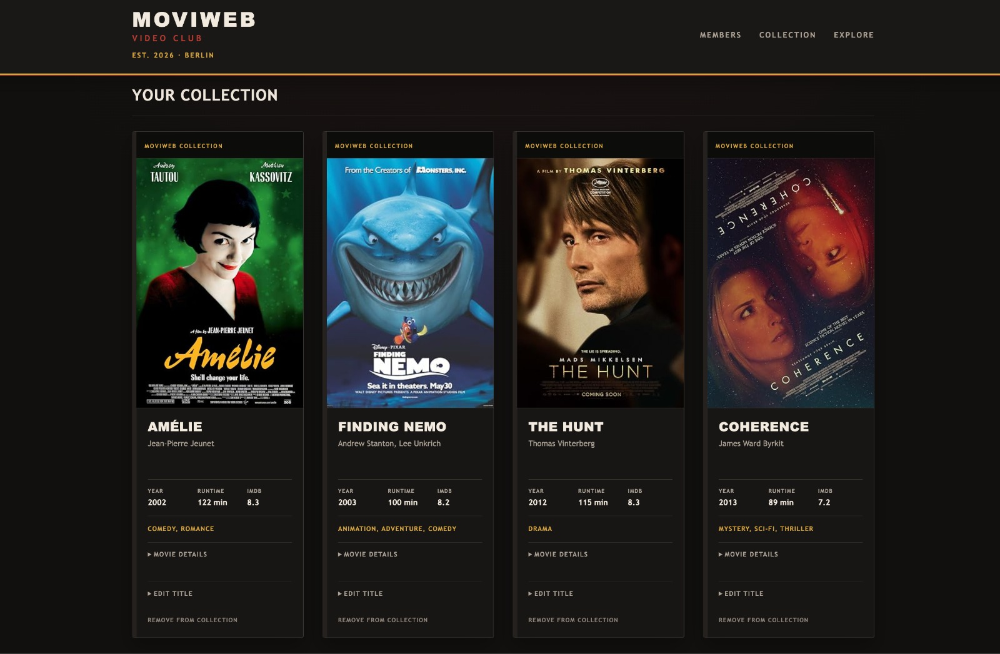
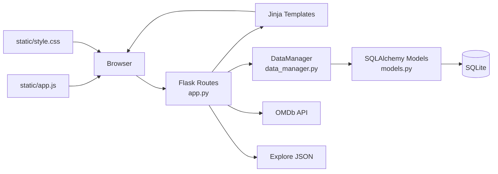
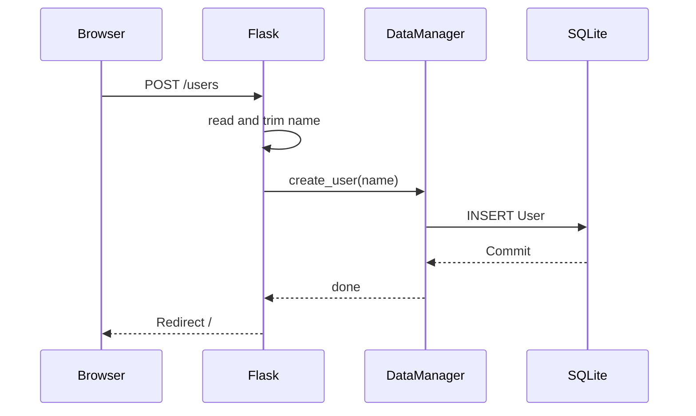
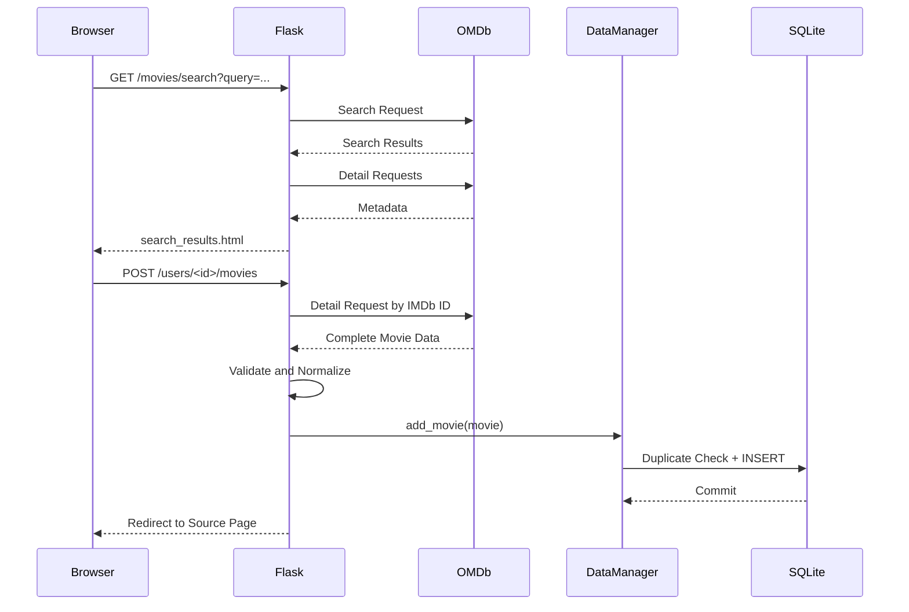

# MoviWeb

MoviWeb is a Flask web application for managing personal movie collections.  
Multiple members can be created, and each member owns an individual collection. Movies are searched through the OMDb API, enriched with metadata, and stored locally in a SQLite database once they are added to a collection.

The project was built as a learning project. The focus is therefore not only on the visible result, but on keeping the flow between Flask routes, database access, external API data, templates, and frontend behavior understandable and well separated.

**Live Deployment:** <https://danielms616.pythonanywhere.com/>



---

## Table of Contents

1. [Project Description](#project-description)
2. [Project Goals](#project-goals)
3. [Technology Stack](#technology-stack)
4. [Project Structure](#project-structure)
5. [Architecture](#architecture)
6. [Data Model](#data-model)
7. [Application Flows](#application-flows)
8. [Route Overview](#route-overview)
9. [OMDb Integration](#omdb-integration)
10. [Explore System](#explore-system)
11. [Frontend and UX](#frontend-and-ux)
12. [Error Handling and Robustness](#error-handling-and-robustness)
13. [Data Integrity](#data-integrity)
14. [Configuration and Secrets](#configuration-and-secrets)
15. [Local Setup](#local-setup)
16. [Deployment on PythonAnywhere](#deployment-on-pythonanywhere)
17. [Testing and Verification](#testing-and-verification)
18. [Important Architecture Decisions](#important-architecture-decisions)
19. [Production-Readiness Boundaries](#production-readiness-boundaries)
20. [Intentional Non-Goals](#intentional-non-goals)
21. [Possible Future Improvements](#possible-future-improvements)

---

## Project Description

MoviWeb represents a simple video club and personal movie collection system.

The application allows users to:

- create and remove members,
- manage an individual movie collection for each member,
- search for movies through OMDb,
- store selected movies with metadata in a local database,
- discover curated movie suggestions through an Explore page,
- manually edit stored movie titles,
- remove movies from a collection,
- handle error states in a controlled and understandable way.

The application does **not** store the complete OMDb database. External movie data is only stored permanently when a user explicitly adds a movie to their collection.

This creates three different kinds of movie data inside the application:

| Area | Data Source | Persisted? |
|---|---|---:|
| Search | OMDb API | No |
| Explore | Local JSON file | No |
| Collection | SQLite / SQLAlchemy | Yes |

This distinction is important. The cards may look similar in the UI, but technically they represent different data sources and different lifecycles.

---

## Project Goals

The project combines the central topics of Flask, SQLAlchemy, HTML/Jinja, and external API usage in one application.

The main learning goals are:

- clear GET/POST route separation,
- server-side rendering with Jinja,
- persistent storage with SQLAlchemy,
- a separate `DataManager` layer for database operations,
- use of an external REST API,
- secure configuration through environment variables,
- understandable error handling,
- data integrity through database constraints,
- responsive frontend behavior,
- deployment of a real Flask application through WSGI.

The goal is deliberately **not** to build as many features as possible.

The main priority is that the existing flows are understandable, consistent, testable, and robust.

---

## Technology Stack

### Backend

- Python
- Flask
- Flask-SQLAlchemy
- SQLAlchemy
- Requests
- python-dotenv

### Data Storage

- SQLite

### Frontend

- HTML
- Jinja2
- CSS
- Vanilla JavaScript

### External Data

- OMDb API

### Deployment

- PythonAnywhere
- Python 3.13
- WSGI

### Python Dependencies

```text
Flask==3.1.3
Flask-SQLAlchemy==3.1.1
SQLAlchemy==2.0.52
requests==2.34.2
python-dotenv==1.2.3
```

Development was tested locally with Python 3.14. The production deployment runs with Python 3.13.

---

## Project Structure

```text
MoviWebApp/
├── app.py
├── data_manager.py
├── models.py
├── requirements.txt
├── .gitignore
├── MoviWebBanner.jpeg
│
├── data/
│   ├── .gitkeep
│   ├── movie_suggestions.json
│   └── movie_suggestions_seed.json
│
├── scripts/
│   └── build_movie_suggestions.py
│
├── static/
│   ├── app.js
│   └── style.css
│
└── templates/
    ├── base.html
    ├── index.html
    ├── movies.html
    ├── search_results.html
    ├── explore.html
    ├── 404.html
    └── 500.html
```

The local `data/movies.db` file and the `.env` file are deliberately **not** tracked by Git.

---

## Architecture

MoviWeb does not use a complex application architecture, but it separates the most important responsibilities clearly.



### `app.py`

`app.py` is the main application layer.

It contains:

- Flask configuration,
- environment variable handling,
- routing,
- OMDb requests,
- normalization of external data,
- flash-message handling,
- redirect logic,
- Explore logic,
- error handlers,
- SQLAlchemy initialization.

A route therefore decides **what should happen for an HTTP request**.

### `data_manager.py`

The `DataManager` encapsulates database operations.

Examples:

```text
create_user()
get_users()
get_user()
delete_user()
get_movies()
add_movie()
update_movie()
delete_movie()
```

This prevents Flask routes from containing SQLAlchemy queries everywhere.

The separation is intentionally simple:

```text
Flask Route
    ↓
DataManager
    ↓
SQLAlchemy
    ↓
SQLite
```

### `models.py`

This file defines the structure of persistent data.

`User` and `Movie` are SQLAlchemy models.

At this level, the database structure defines:

- available columns,
- which fields may be `NULL`,
- primary keys,
- the foreign key,
- uniqueness rules.

### Templates

Jinja templates handle the server-side HTML rendering.

`base.html` provides the shared layout. The individual pages extend this base template.

### Static Files

`style.css` contains the shared visual system.

`app.js` provides small client-side interactions that do not justify a full frontend framework, including:

- poster fallback handling,
- scroll-position preservation after movie actions,
- delete confirmations.

---

## Data Model

### User

| Field | Type | Constraint | Purpose |
|---|---|---|---|
| `id` | Integer | Primary Key | internal unique user ID |
| `name` | String(100) | NOT NULL | visible member name |

The name is deliberately **not unique**.

Two members may have the same name. The technical identity of a user is therefore the numeric `id`.

### Movie

| Field | Type | Constraint | Purpose |
|---|---|---|---|
| `id` | Integer | Primary Key | internal movie ID |
| `name` | String(100) | NOT NULL | stored movie title |
| `director` | String(100) | optional | director |
| `year` | Integer | NOT NULL | release year |
| `genre` | String(200) | optional | genre text |
| `runtime_minutes` | Integer | optional | runtime in minutes |
| `plot` | Text | optional | short description |
| `imdb_rating` | Float | optional | IMDb rating |
| `imdb_id` | String(20) | NOT NULL | external IMDb ID |
| `poster_url` | String(500) | optional | poster URL |
| `user_id` | Integer | Foreign Key, NOT NULL | owner of the collection entry |

### User–Movie Relationship

One user can own multiple movies.

```text
User
  1
  │
  └──────< Movie
            many
```

The relationship is deliberately modeled through the foreign key:

```python
user_id = db.Column(
    db.Integer,
    db.ForeignKey("user.id"),
    nullable=False
)
```

No SQLAlchemy `relationship()` is used.

This is intentional. For the requirements of this project, direct queries using `user_id` are sufficient. An ORM relationship would provide additional convenience, but it is not necessary for the existing flows.

### Duplicate Protection

An IMDb ID is not globally unique inside MoviWeb.

The same movie may exist in different users' collections.

What is not allowed is:

```text
same user
+
same IMDb ID
+
second entry
```

For this reason, `Movie` uses a composite unique constraint:

```text
(user_id, imdb_id)
```

The database therefore enforces the business rule independently from the application-level pre-check.

---

## Application Flows

### 1. Create a Member



After a write operation, the application redirects back to a GET route.

This prevents a browser refresh from accidentally sending the same POST request again.

This pattern is called **Post/Redirect/Get**.

---

### 2. Open a Collection

```text
GET /users/<user_id>/movies
        ↓
load user
        ↓
does the user exist?
    ├── No → 404
    └── Yes
        ↓
load that user's movies
        ↓
render movies.html
```

The application first checks whether the requested user exists.

A collection can therefore not be displayed for a non-existing resource.

---

### 3. Search and Add a Movie



The browser does not send all visible movie metadata back when a movie is added.

Instead, the IMDb ID is used as the external identifier. The server requests the movie data again and decides what is stored.

This avoids trusting modified form fields for important persisted data.

---

### 4. Explore → Add → Preserve Order

Explore uses a curated local recommendation list.

When the page is opened, the list is shuffled. The shuffle order is stabilized through a seed stored in the Flask session.

When a movie is added:

```text
Explore
  ↓
Add to Collection
  ↓
POST
  ↓
store movie
  ↓
redirect with preserve_order=1
  ↓
reuse same session seed
  ↓
same Explore order
```

Without this behavior, the complete recommendation list would be reshuffled after every Add action and the user would lose the visual context.

---

### 5. Edit a Stored Movie Title

The stored title can be edited locally.

This action does **not** request OMDb again.

```text
POST /users/<user_id>/movies/<movie_id>/update
        ↓
find movie for this user
        ↓
update title
        ↓
commit
        ↓
redirect to same movie card
```

The combination of `user_id` and `movie_id` prevents a movie from being updated through another user's URL.

---

### 6. Delete a Movie

```text
Remove from Collection
        ↓
JavaScript confirmation
        ↓
Cancel ──────────→ no POST
        ↓ OK
POST /delete
        ↓
DataManager checks user_id + movie_id
        ↓
DELETE + Commit
        ↓
Redirect to Collection
```

The confirmation is only a frontend protection against accidental clicks.

The actual ownership check remains server-side.

---

### 7. Delete a User

When a user is removed, the user's movies are deleted first and the user record afterwards.

```text
Delete User
    ↓
DELETE Movies WHERE user_id = ...
    ↓
DELETE User
    ↓
single Commit
```

This prevents orphaned movie records.

---

## Route Overview

| Method | Route | Purpose |
|---|---|---|
| `GET` | `/` | display members |
| `POST` | `/users` | create a member |
| `POST` | `/users/<user_id>/delete` | delete member and collection |
| `GET` | `/users/<user_id>/movies` | display personal collection |
| `POST` | `/users/<user_id>/movies` | add movie by IMDb ID |
| `GET` | `/users/<user_id>/movies/search` | search OMDb |
| `GET` | `/users/<user_id>/movies/explore` | curated recommendations |
| `POST` | `/users/<user_id>/movies/<movie_id>/update` | update local title |
| `POST` | `/users/<user_id>/movies/<movie_id>/delete` | remove movie |

Mutating operations deliberately use `POST`.

A normal link or `GET` request should never delete or modify stored data.

---

## OMDb Integration

MoviWeb uses OMDb in two different steps.

### Search

A search starts with an OMDb search request.

The first result page contains up to ten results.

The returned items are then enriched with detail requests so the Search cards can already display additional metadata such as:

- director,
- runtime,
- genre,
- IMDb rating.

### Add

When a movie is added, MoviWeb uses the IMDb ID of the selected result and retrieves the movie data again on the server.

Only then is a `Movie` object created.

### Normalization of External Data

External API data is not stored blindly.

OMDb frequently uses:

```text
"N/A"
```

for unavailable information.

MoviWeb converts those values internally to:

```python
None
```

Data types are normalized as well:

```text
"117 min" → 117
"8.1"     → 8.1
```

The database therefore stores numeric values instead of presentation strings.

### Required and Optional Data

A movie is only stored if the core values required by MoviWeb are usable.

Optional metadata such as:

- director,
- genre,
- runtime,
- plot,
- rating,
- poster

may be missing.

A malformed optional value should not prevent an otherwise valid movie from being stored.

---

## Explore System

Explore is deliberately **not** backed by a second external recommendation API.

The suggestions come from:

```text
data/movie_suggestions.json
```

This keeps the recommendation set:

- reproducible,
- locally controlled,
- independent from another external platform,
- easy to inspect.

The file contains data such as:

- IMDb ID,
- title,
- year,
- poster URL,
- MoviWeb tags.

### Seed File and Build Script

The repository also contains:

```text
data/movie_suggestions_seed.json
scripts/build_movie_suggestions.py
```

These files support maintaining or generating the curated recommendation data.

The runtime application itself reads the finished `movie_suggestions.json`.

### Error States

Explore handles:

- missing file,
- unreadable file,
- invalid JSON,
- unexpected top-level structure.

A broken recommendation file should not expose a raw Python exception page to the user.

---

## Frontend and UX

The frontend deliberately avoids a JavaScript framework.

Server-rendered Jinja pages are sufficient for the current flows.

### Shared Card Language

Search, Explore, and Collection use a visually consistent movie-card system.

The underlying data sources remain technically different.

### Responsive Grid

Movie and member grids are designed so that one or two cards do not stretch unnaturally across the complete page width.

On larger screens, the grid uses `auto-fill` behavior.

On small viewports, layouts intentionally switch to simpler single-column arrangements.

### Poster Fallback

Two different poster error cases are handled:

1. OMDb does not provide a poster URL.
2. OMDb provides a URL, but the image later fails to load in the browser.

MoviWeb displays its own `No Poster` fallback for both cases.

The second case is detected through a JavaScript `error` event.

### Scroll Position

Add and Update actions use Post/Redirect/Get and therefore reload the page.

Before supported form submissions, `app.js` stores the relative position of the affected movie area in `sessionStorage`.

After the redirect, the position is restored.

This avoids losing the user's position on long Search, Explore, or Collection pages.

### Delete Confirmation

Destructive actions receive a native browser confirmation before the POST request.

The confirmation text is provided through a `data-confirm-message` attribute on the form.

A shared JavaScript function handles:

- movie deletion,
- member deletion.

When the user cancels, `event.preventDefault()` stops the form submission completely.

---

## Error Handling and Robustness

Robustness was treated as a separate development concern instead of being added only at the end.

### 404 – Resource Not Found

MoviWeb has a custom `404.html`.

A 404 is used not only for unknown URLs, but also for non-existing application resources.

Examples:

```text
/users/999999/movies
```

or an Update/Delete request for a movie that does not belong to the specified user.

### 500 – Unexpected Internal Error

Unexpected server errors use a custom `500.html`.

The handler also performs:

```python
db.session.rollback()
```

This prevents a failed SQLAlchemy transaction from leaving the database session in an unusable state.

Internal exception details are not shown to the user. The user receives a controlled message while the server can still log the actual exception.

### OMDb Network Errors

HTTP requests use timeouts and `raise_for_status()`.

External failures such as:

- connection errors,
- timeouts,
- HTTP errors,
- invalid JSON

are handled explicitly.

Search can, for example, respond with HTTP `502 Bad Gateway` when the movie service is unavailable.

### Unexpected OMDb Structures

Successfully parsed JSON can still have an unexpected structure.

MoviWeb checks cases such as:

```text
top-level response is not an object
Search field is not a list
single Search item is not an object
detail response is not an object
```

Those values are not blindly passed into `.get()` calls.

### Database Errors During Add

Before inserting a movie, the `DataManager` checks whether the same user already owns the same IMDb movie.

The database unique constraint provides an additional final protection.

If the commit raises an `IntegrityError`:

1. the transaction is rolled back,
2. the application checks whether the conflict was the expected duplicate,
3. only this known duplicate case is handled as a normal user-facing warning,
4. other integrity errors are raised again.

This avoids incorrectly labeling every database integrity failure as "movie already exists".

---

## Data Integrity

MoviWeb protects data both in Python and at database level.

### NOT NULL

Required fields use `nullable=False`.

### Foreign Key

Every stored movie must belong to a user.

```text
movie.user_id
    ↓
user.id
```

### SQLite Foreign-Key Enforcement

SQLite stores foreign-key definitions in the schema but does not automatically enforce them for every connection.

MoviWeb therefore enables:

```sql
PRAGMA foreign_keys=ON
```

for every new SQLAlchemy connection through an SQLAlchemy connect listener.

This matters because SQLAlchemy may open multiple database connections during the lifetime of the application.

### Composite Unique Constraint

```text
UNIQUE(user_id, imdb_id)
```

prevents duplicate favorites for the same user.

### Ownership Checks

Update and Delete operations locate a movie through:

```text
movie_id
+
user_id
```

A technically valid movie ID alone is therefore not enough to modify a record through another user's route.

---

## Configuration and Secrets

MoviWeb keeps sensitive configuration outside the source code.

The application uses:

```text
SECRET_KEY
OMDB_API_KEY
```

The values are stored locally and in production through a `.env` file.

### Example `.env`

```dotenv
SECRET_KEY=replace_with_a_random_secret
OMDB_API_KEY=replace_with_your_omdb_api_key
```

The real `.env` file must **never** be committed.

The `.gitignore` therefore contains entries including:

```gitignore
.env
data/movies.db
venv/
__pycache__/
*.pyc
.idea/
.DS_Store
```

---

## Why `SECRET_KEY` Is Required

The Flask `SECRET_KEY` is not an optional cosmetic setting.

Flask uses it to cryptographically sign session data.

MoviWeb uses sessions for:

- flash messages,
- the temporary Explore shuffle seed.

Without a valid secret key, these features cannot be used securely.

MoviWeb therefore checks the configuration during startup:

```python
app.config["SECRET_KEY"] = os.getenv("SECRET_KEY")

if not app.config["SECRET_KEY"]:
    raise RuntimeError(
        "SECRET_KEY is not configured."
    )
```

The application deliberately refuses to start with an insecure fallback value.

### Generate a Secret Key

Example:

```bash
python -c "import secrets; print(secrets.token_urlsafe(48))"
```

The generated value can then be added to `.env`.

Important rules:

- never place a real secret key in `README.md`,
- never commit the key,
- development and production may use different keys,
- if a key is exposed, generate a new one.

---

## Local Setup

### 1. Clone the Repository

```bash
git clone https://github.com/DanielMS616/MoviWebApp.git
cd MoviWebApp
```

### 2. Create a Virtual Environment

```bash
python -m venv venv
```

Activate it on macOS/Linux:

```bash
source venv/bin/activate
```

### 3. Install Dependencies

```bash
python -m pip install --upgrade pip
python -m pip install -r requirements.txt
```

Check the environment:

```bash
python -m pip check
```

Expected:

```text
No broken requirements found.
```

### 4. Create `.env`

```bash
touch .env
```

Then add:

```dotenv
SECRET_KEY=your_generated_secret
OMDB_API_KEY=your_omdb_api_key
```

### 5. Start the Application

```bash
python app.py
```

When the project is started directly, the `__main__` block calls:

```python
db.create_all()
```

to create missing tables.

The application runs locally on:

```text
http://127.0.0.1:5001
```

---

## Deployment on PythonAnywhere

MoviWeb is deployed on PythonAnywhere with Python 3.13.

The production architecture intentionally differs from the local Flask development server.

```text
Browser
  ↓
PythonAnywhere Web Server
  ↓
WSGI
  ↓
Flask
  ↓
SQLAlchemy
  ↓
SQLite
```

### 1. Clone the Repository

Inside a PythonAnywhere Bash console:

```bash
cd ~
git clone https://github.com/DanielMS616/MoviWebApp.git
cd MoviWebApp
```

### 2. Create the Virtualenv

```bash
python3.13 -m venv ~/.virtualenvs/moviweb
source ~/.virtualenvs/moviweb/bin/activate
```

### 3. Install Dependencies

```bash
python -m pip install --upgrade pip
python -m pip install -r requirements.txt
python -m pip check
```

### 4. Create the Production `.env`

A production `.env` is created inside the project directory.

Example:

```dotenv
SECRET_KEY=production_secret
OMDB_API_KEY=your_omdb_api_key
```

The file can additionally be restricted to the account owner:

```bash
chmod 600 .env
```

### 5. Initialize the Production Database

The local:

```python
if __name__ == "__main__":
```

block is not executed when the application is imported through WSGI.

For this reason, the production database is initialized explicitly once:

```bash
python - <<'PY'
from app import app
from models import db

with app.app_context():
    db.create_all()

print("Production database initialized")
PY
```

### 6. Create a Manual Web App

On PythonAnywhere, the web app is configured with:

```text
Manual Configuration
Python 3.13
```

### 7. Configure the Virtualenv

Example:

```text
/home/<PYTHONANYWHERE_USERNAME>/.virtualenvs/moviweb
```

### 8. Configure WSGI

Example:

```python
import os
import sys


project_path = "/home/<PYTHONANYWHERE_USERNAME>/MoviWebApp"

if project_path not in sys.path:
    sys.path.insert(0, project_path)

os.chdir(project_path)

from app import app as application
```

The WSGI server expects an object named `application`.

The Flask object in `app.py` is named `app`, therefore:

```python
from app import app as application
```

### 9. Configure Static Files

PythonAnywhere can serve CSS and JavaScript directly.

Example mapping:

```text
URL:
    /static/

Directory:
    /home/<PYTHONANYWHERE_USERNAME>/MoviWebApp/static
```

### 10. Reload the Web App

After changes to:

- Python code,
- environment configuration,
- WSGI,
- installed dependencies,

the PythonAnywhere web app must be reloaded.

---

## Testing and Verification

The project was not only tested through the normal happy path.

Testing included manual end-to-end flows, Flask test-client checks, mocking of external failures, and direct SQLite verification.

### Preflight

The following checks were used before deployment:

```bash
git status --short
```

```bash
python -m py_compile \
app.py \
data_manager.py \
models.py
```

```bash
python -m pip check
```

The registered Flask routes were also checked directly.

### SQLite Verification

The database was checked using:

```sql
PRAGMA foreign_keys;
PRAGMA integrity_check;
```

Expected:

```text
Foreign keys enabled: True
SQLite integrity check: ok
```

The database was also checked for duplicate:

```text
(user_id, imdb_id)
```

pairs.

### End-to-End User Journey

The following complete flow was tested:

```text
Create Member
→ Empty Collection
→ Search
→ Add
→ Duplicate Add
→ Explore
→ Add
→ Preserve Explore Order
→ Update Title
→ Movie Delete Cancel
→ Movie Delete Confirm
→ Member Delete Cancel
→ Member Delete Confirm
```

### Negative Tests

The application was tested for:

- unknown URL → 404,
- unknown user → 404,
- unknown movie on Update → 404,
- unknown movie on Delete → 404,
- intentionally triggered server error → custom 500,
- Search with no results,
- simulated OMDb connection failure → 502,
- unexpected OMDb JSON structure,
- missing Explore file,
- invalid Explore JSON,
- broken remote poster URL.

### Responsive Regression

The frontend was tested with different:

- viewport widths,
- member counts,
- movie counts,
- long names,
- long movie titles,
- poster fallbacks.

Grids were explicitly checked with:

```text
1 / 2 / 3 / multiple cards
```

so that small result sets do not stretch cards across the complete available width.

### Production Verification

After deployment, the following were additionally verified:

- public page is reachable,
- static CSS is delivered,
- static JavaScript is delivered,
- production SQLite is writable,
- OMDb is reachable from production,
- JavaScript delete confirmation works,
- data survives a web-app reload,
- foreign keys are enabled in production,
- `PRAGMA integrity_check` returns `ok`,
- `.env` is not tracked by Git.

---

## Important Architecture Decisions

| Decision | Reason |
|---|---|
| DataManager between routes and DB | database access stays separate from HTTP/template logic |
| SQLAlchemy ORM | models and constraints can be expressed clearly in Python |
| SQLite | appropriate for the current learning scope and simple deployment |
| no `relationship()` | direct `user_id` filters are sufficient and avoid unnecessary ORM complexity |
| `user_id` foreign key | every movie entry must belong to an existing user |
| `UNIQUE(user_id, imdb_id)` | same movie may belong to different users, but not twice to one user |
| enable SQLite foreign keys per connection | SQLite does not enforce them automatically |
| IMDb ID as Add contract | server reloads trusted movie data instead of trusting form metadata |
| `None` instead of `"N/A"` | missing external values are represented correctly |
| numeric runtime and rating | values remain sortable and usable for calculations |
| local Explore JSON | recommendations stay controlled and do not require another external API |
| session seed for Explore | order stays stable after adding a movie |
| `SECRET_KEY` without fallback | session functionality must not silently run insecurely |
| POST for mutations | normal GET navigation does not modify data |
| Post/Redirect/Get | prevents accidental duplicate form submissions on refresh |
| custom 404/500 | users receive controlled error pages |
| targeted `IntegrityError` handling | expected duplicates are handled without hiding unrelated DB failures |
| `auto-fill` card grids | a small number of cards keeps a consistent width |
| native delete confirmation | protects destructive actions without introducing a custom modal system |
| Vanilla JavaScript | small interactions do not justify a frontend framework |
| absolute project paths | DB and JSON locations do not depend on the current working directory |

---

## Production-Readiness Boundaries

MoviWeb was hardened far enough to run as a stable and understandable deployed learning project.

It is still **not a fully hardened production platform for arbitrary real-world scale**.

The following boundaries are intentional and documented.

### 1. SQLite and Parallel Writes

SQLite is a good fit for the current project.

Under high concurrent write load, a server database such as PostgreSQL would be more appropriate.

### 2. No Database Migrations

The project uses:

```python
db.create_all()
```

to create missing tables.

`create_all()` does not migrate existing table structures.

Future schema changes would benefit from Alembic or Flask-Migrate.

### 3. Synchronous OMDb Requests

Search currently performs:

```text
1 Search Request
+
up to 10 Detail Requests
```

synchronously.

For the current scale, this is simple and understandable.

At larger scale, possible improvements would include:

- caching,
- fewer detail requests,
- lazy loading,
- parallel requests,
- server-side response caching.

These optimizations were deliberately not added before they were needed.

### 4. No Authentication

The displayed members are collection profiles inside the application.

There is no:

- login,
- password,
- authenticated user account,
- role or permission system.

The numeric user ID separates collections technically, but it is not authentication.

### 5. No CSRF Protection

MoviWeb uses POST for write operations but does not implement CSRF tokens.

For a real public application with authenticated users, CSRF protection would be required.

### 6. No Rate Limiting

The application does not implement its own rate limiting for:

- searches,
- Add requests,
- API usage.

At larger public scale, both application-level limits and OMDb API limits would need to be considered.

### 7. External Availability

Search and Add depend on OMDb.

MoviWeb handles failures gracefully, but it cannot guarantee availability of the external service.

### 8. Remote Poster URLs

Posters are displayed from external URLs.

A poster may disappear later while the movie remains correctly stored in the local database.

MoviWeb handles this case with a visual fallback.

### 9. Single-Instance Filesystem

The SQLite database and Explore files live on the deployment filesystem.

For multiple independent application servers, a shared external database or a different storage architecture would be required.

### 10. No Automated CI/CD Pipeline

Deployment and production verification are intentionally manual and understandable.

A larger project would benefit from automated tests and deployment pipelines.

---

## Intentional Non-Goals

The following features were deliberately **not** included in the project scope:

- email/password registration,
- authentication and roles,
- social features,
- comments,
- personal movie ratings,
- streaming functionality,
- purchase or rental system,
- complex recommendation engine,
- machine-learning recommendations,
- pagination through all OMDb search results,
- automatic caching of all API data,
- background jobs,
- React/Vue/Angular frontend,
- PostgreSQL infrastructure,
- admin dashboard,
- full REST API,
- microservice architecture.

These features would be technically possible, but they would change the focus of the learning project.

The guiding decision was:

> Understand, separate, test, and deploy the existing flows before adding more architecture or features.

---

## Possible Future Improvements

If the project is developed beyond the current learning scope, useful next steps would be:

1. Flask-Migrate/Alembic for schema migrations.
2. CSRF protection for all mutating forms.
3. Real authentication and authorization.
4. PostgreSQL for higher write concurrency.
5. Automated unit and integration tests in the repository.
6. CI pipeline for tests before merge or deployment.
7. Caching for OMDb responses.
8. Pagination for Search.
9. A dedicated service layer for external API communication.
10. Structured production logging instead of simple console output.

These are future improvements, not requirements for the current project scope.

---

## Overall Data Flow

```text
                         ┌─────────────────────┐
                         │       Browser       │
                         └──────────┬──────────┘
                                    │
                                    │ HTTP
                                    ▼
                         ┌─────────────────────┐
                         │      Flask App      │
                         │       app.py        │
                         └───┬────────┬─────┬──┘
                             │        │     │
                 DB access   │        │     │ external request
                             │        │     ▼
                             │        │  ┌───────────┐
                             │        │  │   OMDb    │
                             │        │  └───────────┘
                             │        │
                             │        │ local recommendations
                             │        ▼
                             │   ┌──────────────────────┐
                             │   │ movie_suggestions    │
                             │   │       .json          │
                             │   └──────────────────────┘
                             │
                             ▼
                    ┌─────────────────┐
                    │   DataManager   │
                    └────────┬────────┘
                             │
                             ▼
                    ┌─────────────────┐
                    │ SQLAlchemy ORM  │
                    └────────┬────────┘
                             │
                             ▼
                    ┌─────────────────┐
                    │     SQLite      │
                    │   movies.db     │
                    └─────────────────┘
```

The main architectural idea of the project is:

```text
HTTP behavior
is not
database behavior
is not
external API behavior
is not
presentation
```

The layers work together, but their responsibilities remain separated as far as is useful for the scope of this project.
